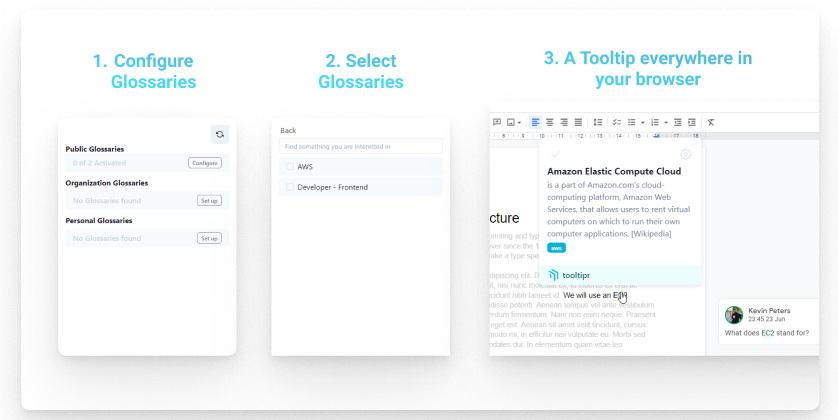

<p align="center">
  
  <h1 align="center">tooltipr</h1>
  <br/>
  <p align="center">
    
  </p>
</p>

<!-- 
    
     -->

> 🦮 A web extension that enables you to see tooltips for common topics and integrates with tooltipr.com to show you individual tooltips, set up by you or your team. 🦮



## 📝 Installation instructions - For users

tooltipr is a browser extension. Unfortunately, at the point of writing this you cannot install the extension via the Chrome Extension Store or the Firefox extension store.

For now the installation has to be done manually, you can find a guide below:

<details>
 <summary>Chrome</summary>

1. Head over to our [releases tab](https://github.com/igeligel/tooltipr-extension/releases): https://github.com/igeligel/tooltipr-extension/releases
2. You will find a `tooltipr-release-chrome.zip` file at the bottom of the release. Download this file.
3. In Chrome go to the extensions page ([chrome://extensions/](chrome://extensions/)).
4. Enable Developer Mode on the top right of the screen.
5. Drag the `tooltipr-release-chrome.zip` file anywhere on the page to import it (do not delete zip afterward).

</details>

<details>
 <summary>Firefox</summary>

</details>

## 💻 Installation instructions - Developers

If you want to develop and contribute to this project, or simply want to create a build of this extension you will need to have the following requirements installed on your machine:

- [Node.js v14](https://nodejs.org/)
- yarn

After that you will need to install the dependencies with:

```bash
yarn
```

## 🏗️ Build

You can build this project in different ways. For a simple build that works in most browsers simply use:

```bash
yarn build
```

<details>
 <summary>For Firefox Production Build</summary>

Go to the main directoryu and use the following command

```
yarn build:firefox
```

This will create a zip file in the root directory called similar to `tooltipr-release-firefox.zip`.

</details>

<details>
 <summary>For Chrome Production Build</summary>

adwwadwad

</details>

## Development
